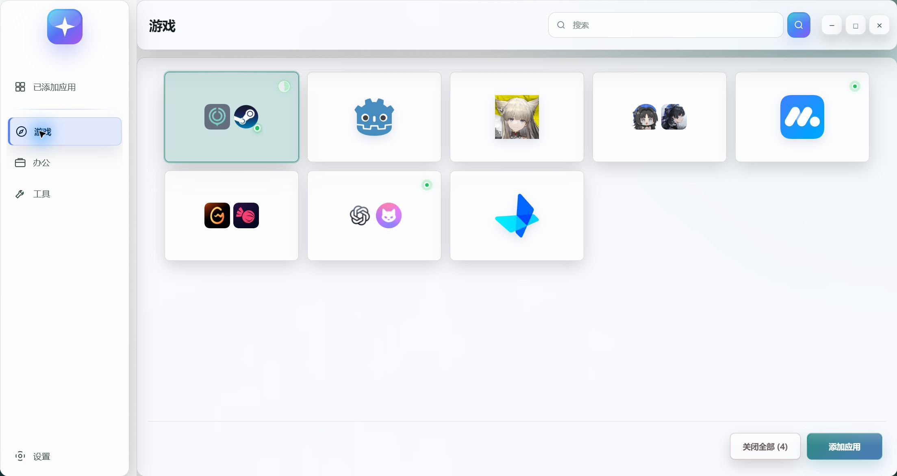
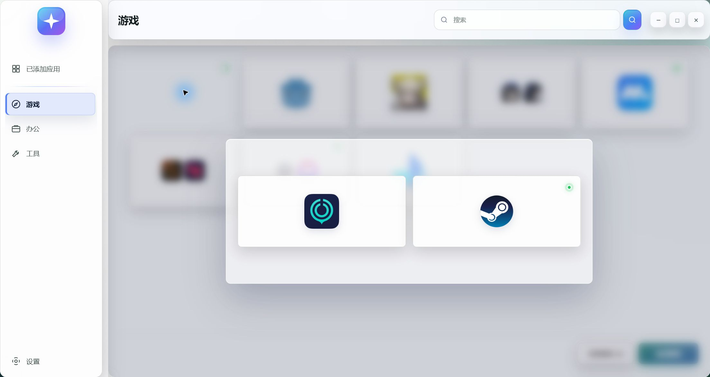

# 给常用软件安个家：我做了一个能合并卡片的 Windows 启动台

桌面快捷方式越堆越多，想玩游戏、写点东西，还得先找一圈软件。

所以我做了 **Start Engineer**：把常用游戏和软件放在一起，按自己的习惯整理，需要时快速打开。

**游戏、办公、工具，各归各位。**

分组可以自己建、自己排顺序。把 EXE 或快捷方式拖进来，就能添加；常用软件不用再满桌面找。

**经常一起用的软件，收进一张卡片。**

把应用拖到一起即可合并。单击展开、分别操作；双击卡片或按默认快捷键 `Ctrl+Enter`，可以批量启动尚未运行的成员。

**不想翻分组？直接搜。**

按 `Ctrl+F` 输入名称，既能找到已添加的应用，也能搜索本机可添加的程序。同一个应用即使同时被 Microsoft Store、开始菜单和本地扫描发现，也只会显示一次；选中本机候选按 Enter，或点旁边的「+」添加。

平时可用方向键或 WASD 选择卡片，选中普通应用后按 Enter 启动或尝试唤起。绿灯表示正在运行，也能按分组批量关闭——**关闭前记得保存工作。**

**外观也能按自己的喜好来。**

提供多套配色、Wallpaper Glass 玻璃主题和 Clear Desktop 透明主题；卡片大小、界面比例和背景颜色也能调整。

界面布局修改会即时应用，支持一键恢复默认。

目前是 **v0.1.4 公开测试版**，支持 **Windows 10 / 11 x64**，无需注册账号。

[下载 Start Engineer v0.1.4（GitHub）](https://github.com/EsspPao/Start-Engineer/releases/tag/v0.1.4)：选 **Setup** 安装版，或 **Portable** 便携版。

提前说明：安装包暂未签名，Windows 可能出现 SmartScreen 提示；部分托盘应用仍需手动打开，暂不支持自动更新。

欢迎试试。遇到问题，可以留言或到 [GitHub Issues](https://github.com/EsspPao/Start-Engineer/issues) 告诉我「哪个软件 + 怎么操作 + 出了什么问题」。
